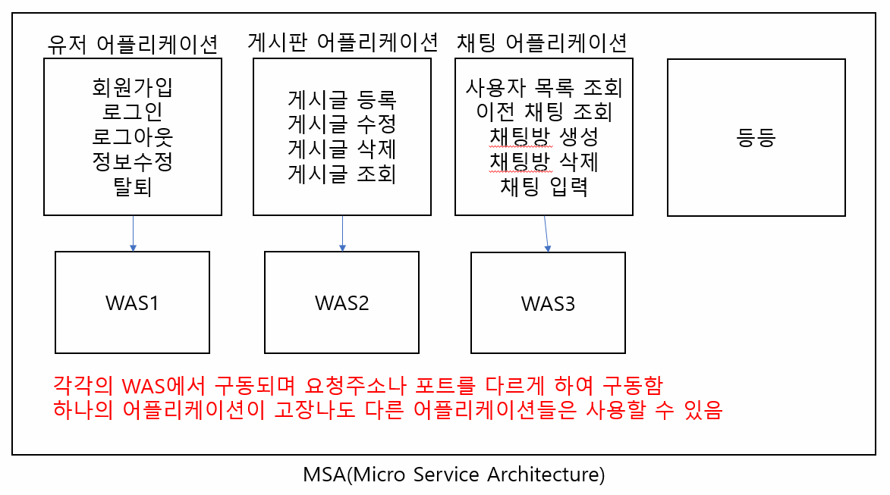

# 1. Spring Boot
1. Spring Boot란
- SpringFramework 기반으로 tomcat이 내장되어 있으며 다양한 라이브러리 및 어노테이션이 추가된 프레임워크
  (@RestController, @Configuration, @Mapper, @Bean..)

2. Spring Boot의 특징
- tomcat을 내장하고 있어서 WAS를 따로 설치할 필요가 없다.
- Spring Framework는 배포시 WAS에서 읽을 수 있는 WAR로 배포,
  tomcat 설치폴더 > bin > shutdown > webapps > WAR 배포 > bin폴더 > startup
  Spring Boot에서는 tomcat이 내장되어 있어서 JAR로 배포
  java -jar jar파일명 => 명령어 입력 시 WAS가 구동되면서 웹 어플리케이션이 실행됨.
- Spring Boot Stater 패키지를 제공하여 빠른 라이브러리 의존성을 설정할 수 있다.
- 설정 자동화 기능을 제공한다. 특정 jar파일이 classpath안에 존재하면 해당 jar파일에 대한 설정을 자동으로 잡아줌.
  예를 들어 Spring MVC jar파일 classpath에 존재하면 Servlet에 대한 설정을 자동으로 구성한다.
- 메인메소드를 가지고 있는 클래스가 존재한다. 메인메소드를 가지고 있는 클래스에는 @SpringBootApplication이라는 어노테이션이 선언되어 있다.
- @SpringBootApplication: 현재 프로젝트가 SpringBootApplication이라고 명시하면서 SpringBootApplication으로  
                          구동되도록 설정해줌(즉, 내장된 WAS를 startup)
                          @EnableAutoConfiguration + @ComponentScan + @Configuration + @Bean
- @EnableAutoConfiguration: 특정 jar파일을 찾아서 설정을 자동으로 구성
- @ComponentScan: 어노테이션(Component, Controller, Service, Repository)가 선언된 클래스를 찾아서 자동으로
                  객체 생성
- @Configuration: 클래스 선언부 위에 붙여서 해당 클래스가 설정파일이라는 것을 명시해줌. 그리고 해당 클래스 안에서 
                  1개 이상의 bean객체를 만들어줘야 함. @Configuration 항상 @Bean과 함께 사용해야 한다.
- @Bean: bean 객체를 생성해주는 어노테이션. SpringFramework에서는 클래스를 불러와 bean객체를 생성했지만 Boot에서는
         @Bean 어노테이션을 메소드위에 선언하므로써 Bean 객체를 생성한다. name이라는 속성이 있는데 지정하지 않으면 
         메소드 명을 카멜케이스화한 이름으로 Bean 객체 생성.
- Spring Boot에서는 API 위주의 개발이 진행된다. @RestController 어노테이션을 Controller 클래스 위에 선언하면
  해당 Controller에 있는 메소드들이 JSON 형태로 데이터를 리턴. Boot에서는 화면으로 이동하지 않고 데이터만 제공해주는 형식의 개발이 주류를 이루고 있다. 
- API(Application Programming Interface): Application 제조사에서 제공하는 Application에 대한 설명이 담겨있는 공식
  문서 또는 다른 Application에서 사용할 수 있도록 제공하는 서비스의 표준.
- API 명세서: API 요청 주소 및 요청 파라미터(필수 값과 필수가 아닌 값으로 구분), 결과 값이 리턴되는 형식을 담고있는 
             문서를 제작 및 공유해야 함.
- 스마트 폰과 태블릿 PC가 탄생하기 전, PC만 사용하던 시기에는 브라우저의 스펙(디스플레이 사이즈)이 동일했다. 그 당시
  API들은 운영되고 있는 본인들의 사이트의 화면(HTML)을 리턴해주는 형태로 존재했다.
- 스마트 폰, 태블릿 PC 등 다양한 스마트 기기들의 등장하면 브라우저의 스펙(디스플레이 사이즈)이 다양해졌다. 기존에 화면을
  리턴해주던 API들을 스마트 폰이나 태블릿 PC에서 사용하려하니 화면 짤리거나 하는 문제가 발생하기 시작했다. 그래서 등장한 
  개념이 REST API(Representational State Transfer API). 플랫폼에 구애받지 않고 스마트 폰이나 PC(데스크 탑, 랩 탑)에서
  동일하게 사용할 수 있는 API 스펙. API 요청 시 xml/json 형태로 데이터만 전달해줌.
- RESTful API: 데이터만 리턴한다고 RESTful하다고 하진 않는다. 리턴되는 형태가 한 어플리케이션에서 동일해야 하며 리턴되는
               형태(객체)가 담고있는 내용들은 요청에 대한 상태값, 에러메시지, 데이터를 담아주는 키값 등이 존재해야 RESTful하다고 한다. Spring Boot에서는 ResponseEntity라는 객체를 제공해주는 데 이 객체안에는 요청에 대한 상태 값 및 에러 메시지부분등이 내장되어 있어 ResponseEntity를 사용하면 RESTful한 API 어플리케이션 제작 가능.
- Spring Framework는 대규모 엔터프라이즈 어플리케이션을 제작하는 데 특화되어 있고 Spring Boot는 MSA(Micro Service    
  Architecture)를 제작하는 데 특화되어 있다.
   

 

- 항상 MSA가 좋은 성능을 내는 것은 아니다. 제작할 어플리케이션이 많아지면 많아질 수록 엔터프라이즈 어플리케이션의 성능이  
  더 좋게 나오게 된다.
- pom.xml보다 간편하게 의존성을 관리할 수 있는 build.gradle파일이 제공된다.
- 자바 소스 기반의 설정파일을 만들수가 있어서 훨씬 직관적이다.
- SpringFramework는 빌드툴로 maven을 사용, SpringBoot는 maven, gradle 중 하나를 선택하여 사용할 수 있다.

3. Spring과 빌드도구(Build Tools)
- 빌드도구의 역할: 빌드도구의 역할은 기본적으로 프로젝트내에 포함되어 있는 모든 파일들을 패키징하여 WAS에서 인식할 수 
                  있도록 변환해주는 도구이다. 기본적인 기능 외 추가로 라이브러리의 의존성관리, 버전동기화등의 기능을
                  제공한다.
- Ant: 초기의 JAVA 빌드도구로 사용된 빌드도구. build.xml 파일에 빌드규칙등을 정의한다. 순차적 진행되기 때문에 빌드규칙의
       순서를 알맞게 정의해야한다. 라이브러리 의존성관리에 취약점을 가지고 있었다. 외부 라이브러리 참조가 불가능했다. 
       필요한 라이브러리가 있으면 직접 다운받아서 참조시켜줘야하는 불편함이 있었고 IDE가 발전할수록 점점 많아지는 라이브러리를 대응하기 어려워서 점점 퇴보했다.
- Maven: Ant의 단점을 보완하여 만든 빌드도구. 외부 라이브러리를 참조하여 사용할 수 있고 pom.xml을 통한 라이브러리 의존성
         관리가 가능하다. 많은 라이브러리들을 사용해도 쉽게 관리할 수 있는 장점이 있다. 아이러니하게 pom.xml이 최대 장점이면서 최악의 단점이 됐다. pom.xml에 라이브러리 의존성이 추가될수록 pom.xml파일을 알아보기도 힘들고 참조한
         라이브러리들을 검색하기도 힘들어졌다.
- Gradle: xml의 단점을 보완하기 위해 groovy언어를 채택하여 라이브러리 의존성 관리를 groovy언어로 수행한다. xml파일에 
          비해 엄청나게 간략하게 작성할 수 있다. Gradle에서는 bulid.gradle파일로 라이브러리 의존성관리, 빌드, 빌드의 생명주기, 버전관리 등을 수행한다. Spring Boot에서는 대부분 Gradle을 빌드도구 채택하여 사용한다.