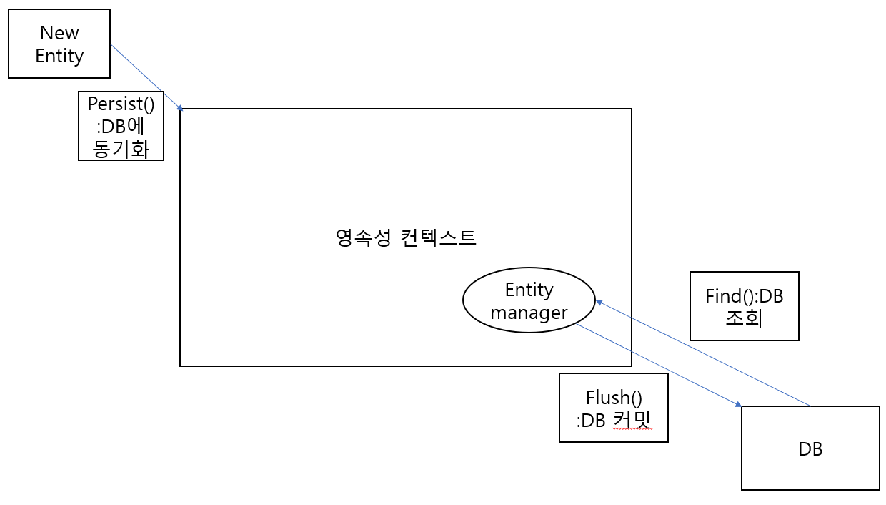

# 1. JPA(Java Persistence API)
1. JPA란
- Java에서 사용하는 ORM(Object Relational Mapping) 기술 표준으로 인터페이스의 모음
- Java Class로 RDB(Relational DataBase) 테이블간의 관계를 표현
- 인터페이스를 Hibernate, OpenJPA를 사용하여 구현
2. 영속성(Persistence)
- 웹 어플리케이션이 종료되도 영원히 저장되어 있는 데이터(RDB)
3. 영속성 컨텍스트(Persistence Context)
- 웹 어플리케이션과 DB사이에서 엔티티와 데이터의 괴리를 해소시켜주는 기능과 엔티티를 보관하는 기능
4. 엔티티(Entity)
- 하나의 테이블에 대해 정의된 클래스
- 엔티티의 모양대로 테이블이 제작되며 엔티티매니져에 의해 Select, Insert, Delete, Update 기능을 사용할 수 있게 됨.
5. 엔티티 매니저(Entity Manager)
- 엔티티를 가져가서 쿼리를 직접 수행하는 객체
- 엔티티 매니저를 상속받은 JpaRepository를 구현하여 DB에 접근하는 방식

