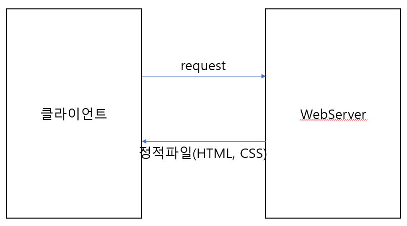
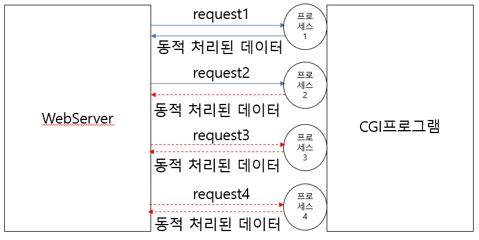
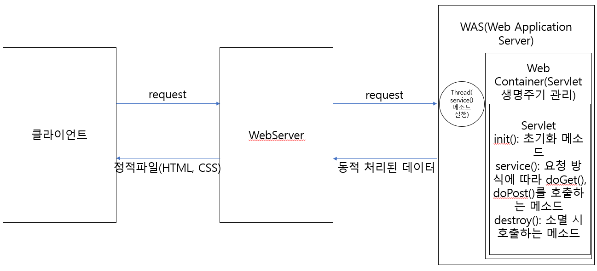
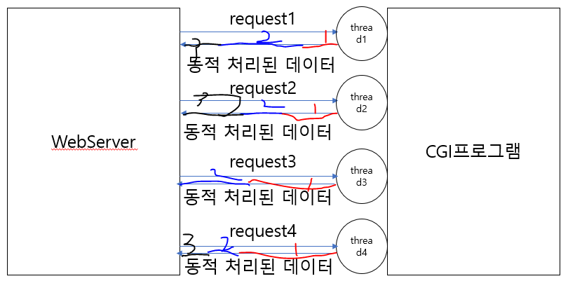
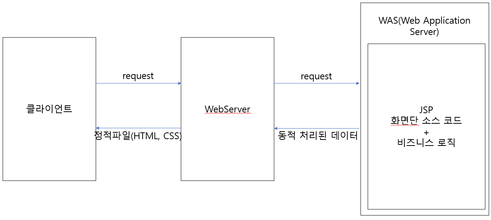
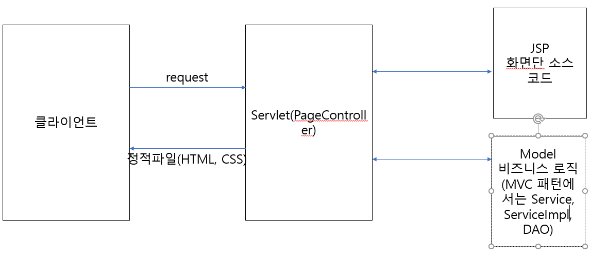
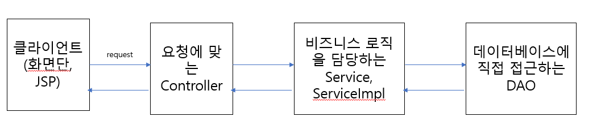
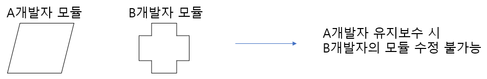
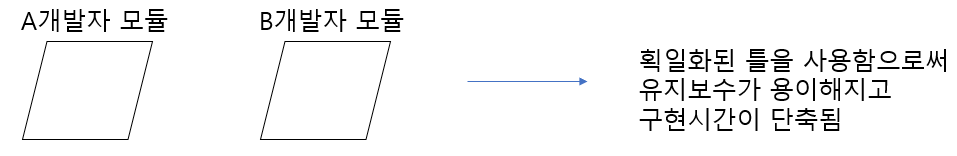

# 1. 웹 개발의 역사

1. Servlet 등장 전
- 초창기 web은 html, css 파일(정적파일)만 넘겨주는 web server의 기능만 존재.
- DB에서 가져온 동적 데이터를 표출할 수 없는 문제 발생

- 그래서 등장한 개념이 CGI(Common Gateway Interface: 동적 데이터 처리에 대한 공통규약)이다.
- CGI 클라이언트에서 request가 오면 WebServer에서 CGI프로그램을 호출하게 되고 CGI프로그램은 요청 하나 당
  프로세스 하나씩을 생성하여 동적 데이터를 처리하게 됨.
- CGI프로그램은 처음에 문제가 없어보였지만 야후같은 대형사이트(사용자가 다수인)가 등장하면서 문제가 발생된다.
- 프로세스는 사용자의 요청이 많아지면 메모리가 계속해서 증가하고 먼저 생성된 프로세스가 처리되기 전까지는 다음
  프로세스가 진행되지 않는 문제점이 있었다.

2. Servlet
- 위에 서술한 문제점들을 보완하기 위해 고안된 방식이 Servlet. Servlet은 요청 하나당 프로세스를 생성하지 않고
  스레드를 하나 씩 생성. 스레드를 통한 병렬 분산처리로 다중 요청에 대한 처리속도를 끌어올렸다. 그리고 Java 소스에서
  HTML 웹 문서를 만들 수 있도록 구현되어 있어 Web Server 성능을 향상시킴.
- Servlet에서 HTML 웹 문서를 만드는 작업이 매우 복잡하고 귀찮은 작업이었다.

3. JSP(Java Server Page)
- Servlet의 소스 코드가 너무 복잡하여 HTML에서 java소스를 사용할 수 있도록 고안된 방식
- 소스코드를 구현하기 쉽고 개발 기간 단축, 화면단과 비즈니스 로직을 모두 가지고 있다.(Model1 방식의 개발)
- 비즈니스 로직과 화면단 소스 코드가 한 파일에 존재하여 코드가 어지럽고 더러워지는 단점이 존재한다.

4. Model2(JSP + Servlet)
- 현재 제일 많이 사용되는 MVC(Model View Controller)의 시초
- JSP는 화면단만 담당, PageController(Servlet)은 화면단과 모델을 연결, Model(비즈니스 로직, Java)

5. MVC 패턴
- Model2 방식에서 좀 진화된 형태의 패턴
- PageController 하나만 존재하던 Model2방식과 다르게 기능별 Controller로 세분화(Http 프로토콜(규약)을 따르는 
  HttpServlet을 상속받아 구현)
- Model부분도 비즈니스 로직을 담당하는 Service, ServiceImpl과 데이터를 담당하는 DAO로 세분화

 

# 2. WEB/WAS
1. WEB서버: 클라이언트에서 요청이 들어올 때 제일 먼저 요청을 받아주는 서버. 요청을 WAS로 보낼 것인지 WEB 서버에서 처리가
            가능한 일인지 판단하여 처리함. WEB 서버에는 정적파일(HTML, CSS, jpg, png, JS ....)들이 저장되어 있음.
            클라이언트가 정적파일을 요청하면 WEB 서버에서 바로 정적파일을 클라이언트로 전달.
            클라이언트가 컴파일이 필요한 동적파일(JSP, Java...)나 DB연동을 요청할 시에는 이 요청을 WAS(Web Application Server)로 전달. Web 서버는 기본적으로 80포트 사용. 잘 알려진 Web 서버의 종류로는 Apache, IIS, ngix, Webtob...등이 있다.

2. WAS(Web Application Server): 실제로 개발자들이 개발한 소스코드를 동작시키는 서버. 화면단 JSP나 비즈로직인 Java, 
                                SQL 쿼리까지 모두 WAS에서 실행됨. WAS는 실행될 때 Servlet Container(서블릿의 생명주기를 관리하는 틀) 동작시킴. 대부분의 경우에 WEB-INF폴더의 web.xml을 읽어서 서블릿 컨테이너를 구동한다. WAS 기본적으로 8080포트를 사용. 잘 알려진 WAS로는 tomcat, 
                                Jeus, Web Logic, Jetty... 등이 있다.
 

# 3. Spring Framework
1. Spring Framework란
- Framework를 직역하면 골격이나 뼈대라는 뜻이다.
- Spring Framework는 웹 개발을 수월하게 진행할 수 있게 제공되는 골격이나 뼈대
- Spring Framework 등장 전 프로젝트에서는 여러 명 개발자가 각자의 스타일대로 소스 코드를 작성
  프로젝트가 끝나고 특정부분 개발자가 빠지게 되면 유지보수의 어려움이 발생
  각자 스타일이 전부 다르기 때문에 소스 코드를 통합하는 작업도 매우 오래걸리고 어려웠다.

- Spring Framework은 이러한 문제를 해결하기 위해 획일화된 웹 개발 뼈대를 제공한다.

2. Spring Framework의 장점
- 빠른 구현 시간: 제공되는 같은 모양의 틀로 소스 코드를 찍어낼 수 있기 때문에 매우 빠른 구현시간
- 유지보수의 용이성: 다른 파트를 개발한 개발자와 동일한 틀을 사용했기 때문에 개발 참여한 개발자는 누구든지 유지보수를 할 수 있다.
- 개발자 능력의 획일화와 인건비 감소: 같은 틀로 개발하기 때문에 능력 차이의 편차가 줄어듬.
                                    신입이라도 개발에 참여하여 개발을 완료할 수 있다.
- 라이브러리 관리: pom.xml을 이용한 라이브러리들을 관리하기 때문에 라이브러리 관리가 매우 편하고 용이하다.
                  Spring Framework 이전에는 개발자가 필요한 라이브러리를 직접 구해서 참조시켜야 했다.

3. Spring Framework의 특징
- DL(Dependency Lookup): 자동으로 생성된 객체들을 찾음. 클래스간의 의존성이 존재할 때 의존성에 알맞은 객체를 찾아주는 작업
- DI(Dependency Injection): 의존성 주입. DL에서 찾은 객체를 의존성으로 주입해주는 작업.
- IOC 또는 IOC컨테이너(Inverse Of Controll: 제어의 역전): 개발자들이 하던 객체생성등을 프레임워크로 위임함
- AOP(Aspect Oriented Programming: 관점 지향 프로그래밍): 로그찍기 같은 공통관심은 프레임워크 설정으로 처리
                                                         개발자들은 오직 비즈니스 로직에만 집중
  function A {
    비즈니스 로직 A - 횡단관심
    로그 찍기 - 공통관심
  }

  function B {
    비즈니스 로직 B - 횡단관심
    로그 찍기 - 공통관심
  }

4. 의존성(dependency)과 결합도, 응집도
- 의존성(dependency): 한 모듈이 다른 모듈의 결과에 영향을 줄 수 있는 관계
                      A 클래스에서 B 클래스를 만들어서 사용할 때 A가 B에게 의존되어 있다.
- 모듈의 독립성을 측정할 때 사용하는 수치가 결합도와 응집도
- 독립성이 우수할 수록 좋은 모듈로 평가하는 데 독립성이 우수하다는 것은 결합도 낮고 응집도는 높은 모듈
- 결합도: 의존성과 동일한 개념, 의존성이 많아지면 결합도 높아짐
- 응집도: 모듈과 관련된 기능이 얼마나 모여있는 지에 대한 판단
          파일업로드 모듈을 만들 때 단일 파일 업로드 기능만 파일업로드 모듈에 넣고 다중 파일 업로드 기능은 다른 모듈에
          넣으면 응집도가 낮아짐
- 결합도를 낮출수 있는 방법은 Interface를 통한 다형성 구현
  -결합도가 높은 방식
  LgTV      클래스
  SamsungTV 클래스
  main() {
    SamsungTV 객체
    LgTV      객체
  }
  -다형성을 통한 결합도 낮추기(생성되는 객체의 수를 줄여서 의존성(결합도)를 낮추는 방식)
  TV 인터페이스
  LgTV      클래스(TV 상속)
  SamsungTV 클래스(TV 상속)
  main() {
    TV 객체(SamungTV를 주입해서 SamsungTV사용, LgTV를 주입했을 때는 LgTV사용)
    TV tv;
    tv = new SamsungTV();
    엘지티비로 바뀌기 전까지는 삼성티비 기능을 사용
    tv = new LgTV();
    엘지티비로 바뀐 후에는 엘지티비의 기능을 사용
  }
  - <b>예제 프로젝트 _002_SpringFramework_Coupling(결합도 높은 방식), _003_SpringFramework_Coupling_Interface(결합도 낮추는 방식)</b>
