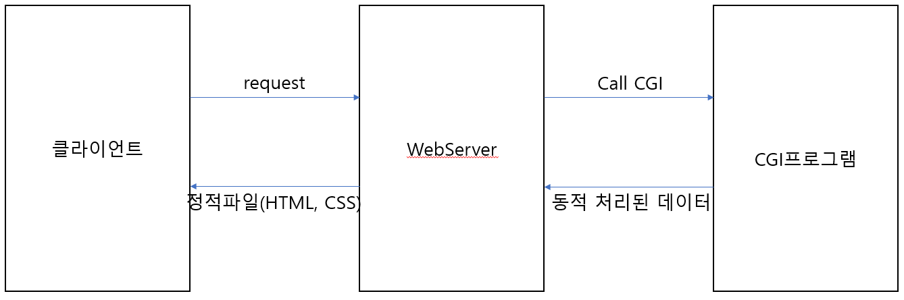

# 1. 웹 개발의 역사

1. Servlet 등장 전
- 초창기 web은 html, css 파일(정적파일)만 넘겨주는 web server의 기능만 존재.
- DB에서 가져온 동적 데이터를 표출할 수 없는 문제 발생

- 그래서 등장한 개념이 CGI(Common Gateway Interface: 동적 데이터 처리에 대한 공통규약)이다.
- CGI 클라이언트에서 request가 오면 WebServer에서 CGI프로그램을 호출하게 되고 CGI프로그램은 요청 하나 당
  프로세스 하나씩을 생성하여 동적 데이터를 처리하게 됨.
- CGI프로그램은 처음에 문제가 없어보였지만 야후같은 대형사이트(사용자가 다수인)가 등장하면서 문제가 발생된다.
- 프로세스는 사용자의 요청이 많아지면 메모리가 계속해서 증가하고 먼저 생성된 프로세스가 처리되기 전까지는 다음
  프로세스가 진행되지 않는 문제점이 있었다.

