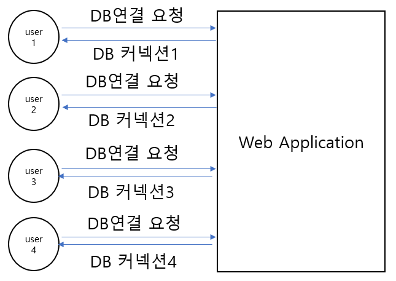
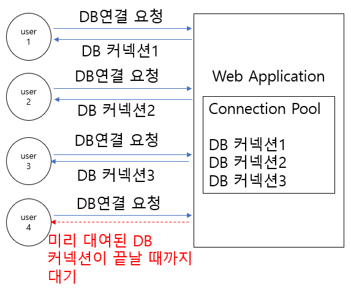
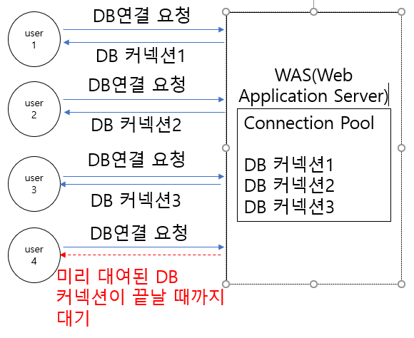

# 1. AOP 실습을 위한 비즈니스 컴포넌트(Service, ServiceImpl, DAO)
1. MVC패턴(Model View Controller)
- Model(비즈니스 컴포넌트): 보편적으로 Service인터페이스, Service를 구현한 ServiceImpl, DB에 직접 접근하는 DAO
                           모든 프로젝트가 위 방식으로 구성되지는 않는다.
- View(화면단): Spring Framework에서는 JSP가 화면단을 담당
                Spring Boot에서는 HTML이나 React, Vue 등등 화면단을 담당
- Controller(서블릿): View과 Model 연결해주는 역할.
                      View에서 넘어오는 데이터를 받아서 비즈니스 로직(Model)로 전달
                      비즈니스 로직 처리가 완료된 데이터를 View 넘겨주고 해당 View를 호출
- <b>예제 프로젝트: _012_SpringFramework_BusinessComponent</b>

2. DB 연동 방식 JDBC/DBCP/JNDI
- JDBC(Java DataBase Connectivity): 자바에서 제공해주는 DB 연결 표준 API
                                    connection pool을 생성하지 않고 DB연결 요청이 올 때마다 연결을 하나씩 생성
                                    많은 사용자들이 DB연결을 요청하면 연결 개수가 증가해서 DB서버의 과부하나
                                    웹 어플리케이션의 메모리 부족을 발생시킬 수도 있다.
                                    비효율적인 방식이라 일반 상용 어플리케이션에서는 거의 사용하지 않음

- DBCP(DataBase Connection Pool): Web Application에서 미리 지정한 개수만큼의 DB 커넥션을 만들어서 Pool에서 관리
                                  DB 접근 요청이 오면 DB 커넥션을 하나씩 대여해줌. DB 접근 요청이 끝나게 되면
                                  대여해준 DB 커넥션을 다시 돌려받는 방식. 
                                  DBCP 상속받은 DataSource 객체가 DB 커넥션들을 관리.
                                  DB 커넥션의 개수를 적절하게 지정하는 것이 중요.

-JNDI(Java Naming and Directory Interface): Web Application이 아닌 WAS(Web Application Server)에서 DB Connection 
                                            Pool을 생성하고 관리.
                                            설정이 간편하고 Web Application에 과부화를 방지할 수 있기 때문에 가장 많이 사용되는 방식.

3. pom.xml의 라이브러리와 의존성
- pom.xml의 라이브러리가 변경되면 프로젝트 전체에 영향을 주기 때문에 프로젝트가 라이브러리에 의존되어 있다.
  따라서 pom.xml에 라이브러리를 참조하는 것을 의존성 주입이라고 하고 <dependency> 엘리먼트를 이용해서 설정한다.

4. 영속성(persistence)
- 영속성이란 어플리케이션이 종료되도 계속 저장되어 있는 데이터의 특성을 뜻함.
- 영속성을 따라 DB와 어플리케이션을 연동하여 사용한다.
- 영속성은 JDBC를 통해 구현된다.
- 영속성을 구현하는 방식 두 가지
  SQLMapper 방식과 ORM 방식
  - SQLMapper 방식은 쿼리를 Mapper에 직접 매핑하여 사용하는 방식
    대표적인 프레임워크(MyBatis, iBatis)
    테이블과 1대 1로 매핑되는 객체: VO(Value Object)나 DTO(Data Transfer Object)
  - ORM(Object Relation Mapping) 방식은 테이블들간의 연관관계를 객체로 매핑시켜서 사용하는 방식
    대표적인 프레임워크(hibernate)
    테이블과 1대 1로 매핑되는 객체: Entity(테이블간의 관계도 설정)

5. 자바의 메소드 정의
- 접근제어자(public, private, protected, default) 반환타입(return 타입) 메소드명(매개변수) {
  메소드 구현
  반환타입이 void return값이 없다.
  반환타입이 void 외에 데이터타입이나 클래스로 지정될 경우 return 반환타입과 일치해야된다.
}