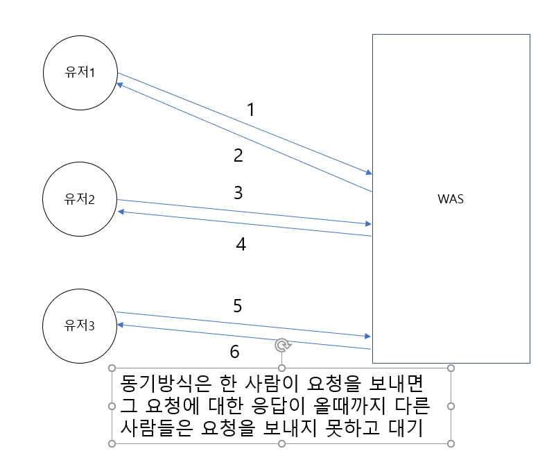
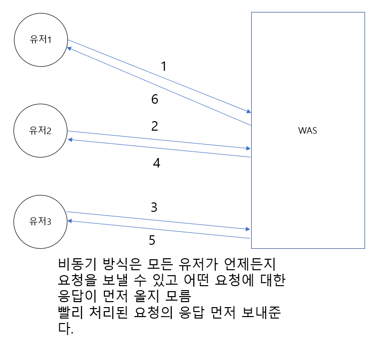

# 1.Ajax(Asynchronous Javascript And Xml)
1. Ajax란
- 자바스크립트에서 지원하는 비동기 통신 모듈
- 비동기 통신 모듈을 사용하면 화면의 전체를 변경하는 게 아니고 원하는 부분만 변경할 수 있다.
2. Ajax의 두 가지 방식
- 순수 자바스크립트로 사용(XmlHttpRequest): 이 방식은 사용법이 복잡하여 잘 사용되지 않는다.
- Jquery의 Ajax: Jquery라이브러리에서 Ajax을 사용하기 편하게 구성해놓음.
- $.ajax(get, post)({
    설정 값
  })
- 순수 자바스크립트의 ajax보다 사용하기 편리하여 많이 사용된다.
- ajax로 호출된 요청에서는 json형태의 데이터를 리턴.
3. Jquery ajax의 설정 값들
- $.ajax({
    url: 요청주소('/user/join.do'),
    type: 'get'이나 'post',
    async: true나 false(true 비동기, false 동기),
    data: 요청주소로 넘겨줄 파라미터 지정,
          문자열, 배열, 객체형태의 파라미터를 지정가능,
          문자열일 경우 url인코딩을 직접 해야한다.
          (한글이나 특수문자를 유니코드로 변환)
          문자열 => "keyword=%EC%98%A43&mode=2"
          배열 => [
            {name: '고기천', value: 1},
            {name: '홍길동', value: 2}
          ]
          배열로 보낼 때 주의할 점은 배열로 보내준 파라미터를 자바단에서 배열로 인식 못하는 경우가 있다.
          배열같은 경우 JSON.Stringify(배열)를 통해 JSON문자열로 변경후 전송하는 게 낫다.
          객체 => {name: '고기천', value: 1},
    contentType: 넘겨줄 파라미터의 데이터 형식 지정.
                 기본 값: application/x-www-form-urlencoded(url인코딩된 폼 데이터 형식)
                          => "keyword=%EC%98%A43&mode=2"
                          form.serialize() => 폼 안의 데이터들을 url 인코딩된 폼 데이터 형식으로 변경
                          application/json, html... 등
    /*콜백 함수 영역*/
    success: function(obj, status, xhr) {
      function의 파라미터는 ajax가 성공했을 때 백단에서 전송한 데이터.
      ajax 요청이 성공했을 때 실행될 동작을 구현.
      동적태그로 태그를 재생성.
      var htmlStr = '';
      htmlStr += '<h1>';
      htmlStr += '  
obj.keyword
';
      hrmlStr += '</h1>';

      변경할 태그 선택자.html();
      변경할 태그 선택자.html(hrmlStr);
      
      status: 요청의 상태정보를 문자열로 전달받는 파라미터
      xhr: XMLHttpRequest 객체로 요청에 대한 정보를 담고있음
    },
    error: function(xhr, status, error) {
      요청이 실패했을 때 실행될 콜백함수
      error: 에러정보를 문자열로 받아오는 파라미터
    }
  });
4. 비동기와 동기의 비교
- 비동기의 장점은 처리속도가 매우 빠르다. 대기하는 시간이 짧다.
- 비동기의 단점은 데이터의 보존이 보장되지 않음.
- 

- 

